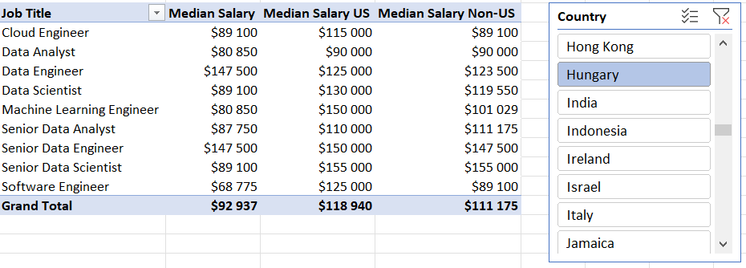

# Excel Data Job Analysis

## Introduction

As someone interested in the world of data jobs, my goal with this project was to explore the most optimal jobs and skills in the data science market. I also wanted to do my analysis in a way that helped me learn functionalities of Excel that I previously was not familiar with and showcase this newly gained knowledge. I set out to understand what skills top employers request and how to land more pay.

### Questions to Analyze

To understand the data science job market, I asked the following:

1. **Do more skills get you better pay?**
2. **What's the salary for data jobs in different regions?**
3. **What are the top skills of data professionals?**
4. **What's the pay for the top 10 skills?**

### Excel Skills Used

The following Excel skills were utilized for analysis:

- **Pivot Tables**
- **Pivot Charts**
- **DAX (Data Analysis Expressions)**
- **Power Query**
- **Power Pivot**

### Data Jobs Dataset

The dataset used for this project contains real-world data science job information from 2023. The dataset is available via the [Excel for Data Analytics course](https://www.youtube.com/watch?v=pCJ15nGFgVg), which provides a foundation for analyzing data using Excel. Creating this project was a part of this course.

It includes detailed information on:

- **Job titles**
- **Salaries**
- **Locations**
- **Skills**

## 1. Do more skills get you better pay?

### The tool used: Power Query (ETL)

#### Extract

- First Power Query was used to extract the original data (`data_salary_all.xlsx`) and create two queries:
    - One with all the data jobs information with the focus on salaries.
    - An other listing the skills for each job posting.

#### Transform

- Then, each query was transformed by changing column types, removing unnecessary columns, cleaning text to eliminate specific words, and trimming excess whitespace. The steps displayed in the following images are Hungarian, but they do what I described before.

    - data_jobs_salaries

        

    - data_job_skills

        

#### Load

- Finally, I loaded both transformed queries into the workbook, setting the foundation for my subsequent analysis.
    - data_jobs_salary

        

    - data_job_skills

        

### Analysis

- According to this data, there seems to be a connection between the number of skills requested in job postings and the median salary - a posting with a higher number of skills needed mostly has a higher salary listed, particularly in roles like Senior Data Engineer and Data Scientist.

- Roles that require fewer skills, like Business Analyst, tend to offer lower salaries, suggesting that more specialized skill sets command higher market value in the data job market.

- This trend emphasizes the value of acquiring multiple relevant skills, particularly for workers or job seekers aiming for higher-paying roles.

    

## 2. What's the salary for data jobs in different regions?

### The tool used: PivotTables and DAX

#### Pivot Table

Using Power Pivot and the data model I created with it, I inserted a PivotTable with Job Titles as rows and Average Salary as values. Then I added a new measure to calculate the median salary for United States jobs. (I would have liked to focus this on Hungary, but not enough data was present in the data set to get relevant information.)

```
=CALCULATE(
    MEDIAN(data_jobs_salary[salary_year_avg]),
    data_jobs_salary[job_country] = "United States"
)
```

#### DAX

To calculate the median yearly salary I used DAX.

```
Median Salary := MEDIAN(data_jobs_salary[salary_year_avg])
```

### Analysis

 Job roles like Senior Data Engineer and Data Scientist get offered higher median salaries both in the US and internationally, pointing out a global demand for high-level data expertise. The salary disparity that can be found between US and Non-US roles is particularly notable in high-tech jobs, which might be influenced by the concentration of tech industries in the US. However, I find it likely that non-US regions may be under represented in the dataset because the collection of this data is US based.

 These salary insights are important for planning and salary negotiations, helping professionals and companies align their offers with market standards while considering geographical variations.



## 3. What are the top skills of data professionals?

### The tool used: Power Pivot

#### Power Pivot

I created a data model by integrating the `data_jobs_salary` and `data_jobs_skills` tables into one model. Since I had already cleaned the data using Power Query; Power Pivot created a relationship between these two tables.

#### Data Model

I created a relationship between my two tables using the `job_id` column that was previously added to the tables in Power Query.


### Analysis

SQL and Python seem to dominate as top skills in data-related jobs, reflecting their foundational role in data processing and analysis. Emerging technologies like AWS and Azure also show significant presence, underlining the industry's shift towards cloud services and big data technologies. Understanding prevalent skills in the industry not only helps professionals stay competitive but also guides training and educational programs to focus on the most impactful technologies.


## 4. What's the pay of the top 10 skills?

### The tool used: Advanced Charts (Pivot Chart)

#### PivotChart

- I created a combo PivotChart to plot median salary and skill likelihood (%) from my PivotTable.
  - Primary Axis: Median Salary (as a Clustered Column)
  - Secondary Axis: Skill Likelihood (as a Line with Markers)
- To customize the chart, I added a title, axis title, removed the lines (skill likelihood), and changed the markers to diamonds.


### Analysis

Higher median salaries are associated with skills like Python, Oracle, and SQL, suggesting their critical role in high-paying tech jobs. Skills like PowerPoint and Word have the lowest median salaries and likelihood, indicating less specialization and demand in high-salary sectors.

This chart highlights the importance of investing time in learning high-value skills like Python and SQL, which are evidently tied to higher paying roles, especially for those looking to maximize their salary in the tech industry.

## Conclusion

I embarked on this Excel-based project to uncover valuable insights about the data science job market while learning about Excel. Using the dataset provided by the course, that is from real-world job postings, I analyzed job titles, salaries, locations, and essential skills. By learning about and leveraging Excel features like Power Query, PivotTables, DAX, and charts, I discovered key connections between multiple skills and higher salaries, particularly in Python, SQL, and cloud technologies.

I hope not only will this project help to gain insight into the data job market, but I will also showcase the features and functionalities of Excel that I learned about with the Excel for Data Analytics course.