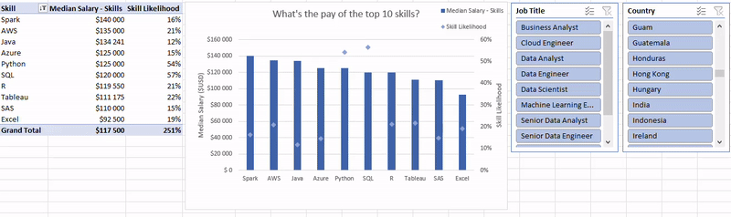

# Excel Data Analytics Projects

## Introduction

Welcome to my projects I created while taking the Excel for Data Analytics course!

These projects serve two purposes.

- Through them, I would like to showcase my knowledge and skill - that partially I already have had but no denying that I have also gained while taking the course - in Excel when it comes to data analysis.

- I also hope that these projects will provide a tool for workers and job seekers in the data job market that they can use to gain a better understanding when it comes to the skills required for different positions or the compensation for their work.

The dataset that served as the base of my analysis is from the [Excel for Data Analytics course](https://www.youtube.com/watch?v=pCJ15nGFgVg) created by [Luke Barousse](https://github.com/lukebarousse) and [Kelly Adams](https://github.com/kellyjadams). This dataset provides information about real-life job postings from 2023 in the data job market, going into detail such as job titles, salary averages, countries and locations, and the skills listed in the postings.

## Salary Dashboard

This dashboard was created to take a look into the world of data job postings and aims at helping workers and job seekers investigate salaries for their current or desired jobs and ensure they are being adequately compensated.

Take a look at my work here: [1_Project-Dashboard](1_Project-Dashboard)

## Salary Analysis

As someone interested in the world of data jobs, my goal with this project was to explore the most optimal jobs and skills in the data science market. I also wanted to do my analysis in a way that helped me learn functionalities of Excel that I previously was not familiar with and showcase this newly gained knowledge. I set out to understand what skills top employers request and how to land more pay.

Take a look at my work here: [2_Project-Analysis](2_Project-Analysis)

